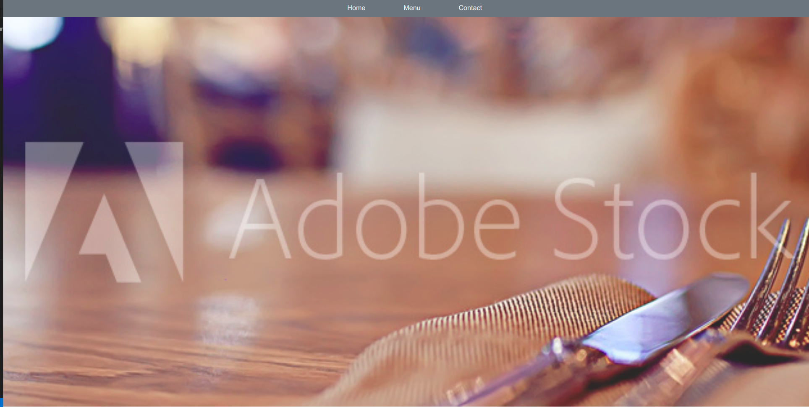

# Project-Library

This is the second project on Microverse JavaScript curriculum, to learn the DOM manupilation, modularity and WebPack.

<br>

## Built With

- JavaScript
- ESLint
- StyleLint

## Prerequisities

To get this project up and running locally, you must have node installed on your local machine.

## Getting Started

**Setup**

- Clone this repository with ```git clone git@github.com:eypsrcnuygr/Restaurant.git``` using your terminal or command line.<br>
- Change to the project directory by entering ```cd Restaurant``` in the terminal<br>
- Next run ```npm install``` to install the necessary dependencies<br>
- Run ```npm run watch``` to have the necessary changes applied if you want to change anything in the codebase.
- Finally run the 'index.html' with 'Live Server' to start the application.<br>

## Authors

👤 **Eyüp Sercan UYGUR**

-   Github: [@eypsrcnuygr](https://github.com/eypsrcnuygr)
-   Twitter: [@eypsrcnuygr](https://twitter.com/eypsrcnuygr)
-   LinkedIn: [eypsrcnuygr](https://www.linkedin.com/in/eypsrcnuygr/)
-   Email: [Eyüp Sercan UYGUR](sercanuygur@gmail.com)


## 🤝 Contributing

Contributions, issues and feature requests are welcome!

## Show your support

Give a ⭐️ if you like this project!

## Acknowledgments

-   This Project was part of an assignment available on The Odin Project.
-   Our thanks to Microverse and all our peers and colleagues there.

## 📝 License

This project is [MIT](lic.url) licensed.
